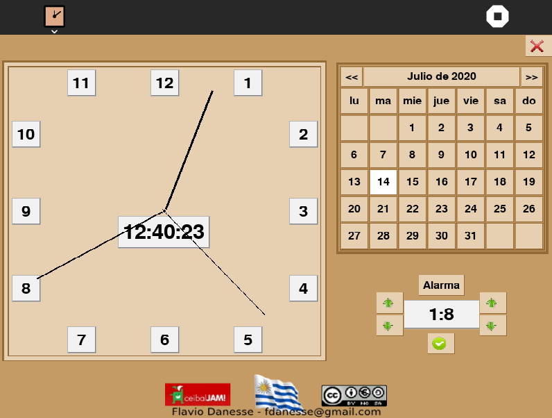

Jam-Clock activity 
===============

JAM-Clock is a simple clock activity where you can set alarms and also view the calender.

How to use?
===============

JAM-Clock activity is not a part of Sugar Desktop but can be added. Refer to the following links-

* [How to Get Sugar on sugarlabs.org](https://sugarlabs.org/), 
* [How to use Sugar](https://help.sugarlabs.org/)

How to upgrade?
===============
On Sugar Desktop systems;

* [Use My Settings,](https://help.sugarlabs.org/my_settings.html) [Software Update](https://help.sugarlabs.org/my_settings.html#software-update) 
* [Use GitHub to open](https://github.com/sugarlabs/jam-clock-activity), Check the tags, then download the latest version.
